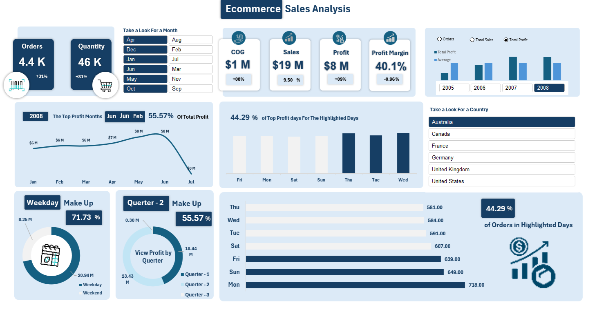
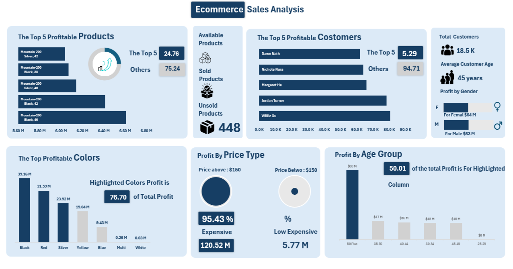

# 🛒 Ecommerce Dashboard

A modern, responsive dashboard designed to manage and visualize ecommerce data efficiently.

## 📌 Client Requirements

The client requested the following features and functionalities:

- A clean and intuitive user interface
- Time analysis and Identify Patterns 
- Customer Anlysis (Age - Country)
- Product Anlysis and Identify Top Product
- Anlysis thier Profit
- Responsive design


## 📖 Description

The Ecommerce Dashboard is built to streamline the management of online store operations. It provides a centralized platform for monitoring sales and managing customers.
## 🧪 Phase 1: Time-Based Analysis

The first phase of the project focused on analyzing performance over time. Here's what was implemented:



### 📊 KPI Cards

- Created summary cards for key performance indicators (KPIs)
- Compared current year metrics to the previous year
- Highlighted positive and negative trends with visual cues

### 📈 Profit Analysis

- Analyzed total profit across different time dimensions:
  - Monthly
  - Daily
  - Quarterly
- Visualized trends to identify peak and low-performing periods

### 📦 Orders Analysis

- Tracked number of orders per day
- Highlighted top-performing days with the highest order volume

### 🌍 Filtering Capabilities

- Implemented dynamic filters for:
  - Country
  - Specific year and month
- Enabled users to drill down into more detailed, contextual insights

## 🧩 Phase 2: Customer & Product Analysis

This phase focused on understanding product performance and customer behavior.



### 🛍️ Product Analysis

- Identified the most profitable products
- Tracked:
  - Total units sold
  - Unsold inventory
  - Overall stock levels
- Analyzed top-selling products by:
  - 🎨 **Color**: Determined which colors performed best in sales
  - 💰 **Price Type**: Compared high-priced vs. low-priced product performance

### 👥 Customer Analysis

- Visualized top customers by total profit contribution
- Analyzed customer demographics:
  - 📊 Average age
  - 🚻 Gender distribution
- Identified the most profitable customer segments based on age and gender groups

---


## 🛠 Installation

Clone the repository and install dependencies:

```bash
git clone https://github.com/yourusername/ecommerce-dashboard.git
cd ecommerce-dashboard
npm install
